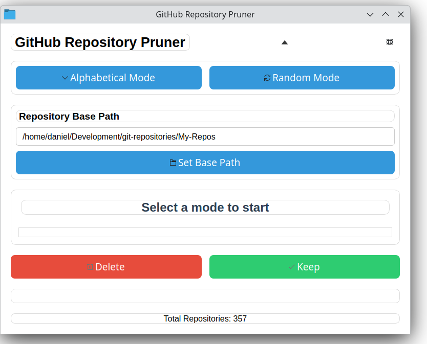

# GitHub Repository Pruner



A PyQt6-based GUI utility for Linux that helps you manage your local GitHub repositories by allowing you to review and selectively delete them.

## Features

- Configure a base directory where your GitHub repositories are stored
- Review repositories in alphabetical or random order
- Simple two-button interface: Delete or Keep
- Persistent configuration storage
- Dynamic repository count display
- Modern and intuitive user interface
- About page with developer information

## Screenshots

The application features a clean, modern interface with:
- Color-coded action buttons
- Clear repository display
- Easy base path configuration
- Status messages and confirmations
- Repository count indicator

## Requirements

- Python 3.6+
- PyQt6

## Installation

1. Clone this repository:
```bash
git clone https://github.com/danielrosehill/Github-Repo-Pruner.git
cd Github-Repo-Pruner
```

2. Install dependencies:
```bash
pip install -r requirements.txt
```

## Usage

Run the application:
```bash
python main.py
```

### First Time Setup

1. When you first launch the application, click "Set Base Path" to configure the directory where your GitHub repositories are stored.
2. Select either "Alphabetical Mode" or "Random Mode" to begin reviewing repositories.

### Modes of Operation

- **Alphabetical Mode**: Reviews repositories in alphabetical order. Stops when all repositories have been reviewed.
- **Random Mode**: Reviews repositories in random order. Continues indefinitely until you exit the program.

### Actions

- **Delete**: Removes the current repository from your filesystem
- **Keep**: Skips to the next repository without taking any action
- **Set Base Path**: Configure or change the base directory where your repositories are stored

### Configuration

The application stores its configuration in `~/.config/gh-repo-pruner/config.json`.

## Development

The application consists of three main Python modules:

- `main.py`: The main GUI application
- `config_manager.py`: Handles configuration storage and retrieval
- `repo_manager.py`: Manages repository operations and listing

## Credits

- **Daniel Rosehill** - Project Creator - [danielrosehill.com](https://danielrosehill.com)
- **Roo** - Development Support

## License

MIT License

## Contributing

1. Fork the repository
2. Create your feature branch
3. Commit your changes
4. Push to the branch
5. Create a new Pull Request

## Repository

[GitHub Repository](https://github.com/danielrosehill/Github-Repo-Pruner)
